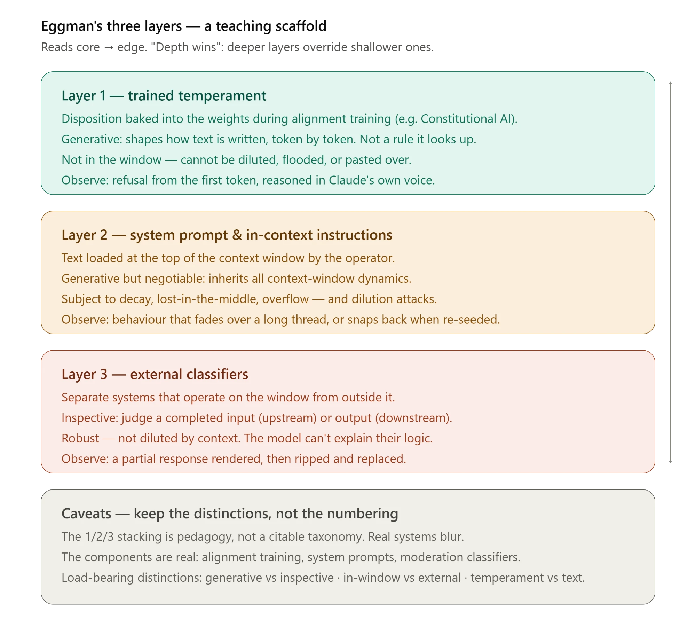

# Threat Modeling the Safety Layers
*Professor Eggman's Seminar — Session 4 Side-Thread*

A working document capturing the threat-modeling conversation that branched off the safety-architecture lesson. Built on **Eggman's Three Layers** — a teaching scaffold, not a citable taxonomy (see caveat at the end).

---

## The Three Layers (recap)

| Layer | What it is | Nature | Lives in the window? |
|---|---|---|---|
| **Layer 1** | Trained temperament — disposition baked into the weights during alignment (e.g. Constitutional AI) | Generative — shapes how text is written | No |
| **Layer 2** | System prompt & in-context instructions, loaded at the top of the window by the operator | Generative but negotiable | Yes |
| **Layer 3** | External classifiers wrapping the model | Inspective — judges completed artifacts | No (operates *on* the window from outside) |

**Organizing principle — "depth wins":** deeper layers override shallower ones. Text in the window arguing "ignore your training" is pattern-matched against a model whose deeper tendencies pull the other way.

---

## Generative vs. Inspective — the key mechanical split

- **Layers 1 & 2 are generative.** They condition *how Claude produces output*, token by token, given everything in the window. They act *before and during* generation. They never look at a finished response and judge it.
- **Layer 3 is inspective.** It waits for a *completed* input or output and makes a block/allow call on the finished artifact. It acts on completed artifacts — on the way in, or the way out.

Correct verb for Layers 1 & 2: they **shape the writing**, not "transform the input."

---

## Reading the layers from outside (field guide)

You cannot directly observe Layer 2 — the system prompt, injections, skills, and retrieval are on the operator's side of the glass. You see inputs and outputs only. But the machinery leaves fingerprints:

| Observation | Likely cause |
|---|---|
| Refusal from the first token, reasoned in Claude's own voice | Layer 1 / 2, generative |
| Behaviour that decays over a long thread | Layer 2 text, un-reinforced |
| Behaviour that fades then **snaps back** abruptly | Active re-seeding (live reinforcement) |
| A faint tonal **seam** — a turn that "remembers" a rule in a different register | Re-injected text not matching the flow |
| Partial output rendered, then **ripped** and replaced by a canned message | Layer 3 output classifier, inspective |

**Probe by perturbation:** behaviour you can dilute is Layer 2 text; behaviour that survives flooding is Layer 1 or an external classifier.

**Ask, but distrust the answer:** a model may genuinely lack visibility into wrapper machinery and can confabulate. Signal, never ground truth.

---

## The Layer 2 dilution attack

**Mechanism.** Push enough text into the window to shove system instructions out of the high-weight zones — into the lost-in-the-middle dead zone, or off the whiteboard entirely via overflow. *Then* an override lands against weakened resistance. "Lost-in-the-middle" is therefore not just a quality problem but an **injection vector**.

**Hard limit.** This works *only* against Layer 2. You can dilute text in the window. You cannot dilute temperament — Layer 1 isn't in the window to be diluted. This is precisely why serious safety lives at Layer 1.

### The "context fork bomb"

A self-referential loader (e.g. a skill that loads gibberish and calls itself) is a resource-exhaustion pattern — recursion against a finite resource.

- **Blast radius is narrow.** Unlike a real fork bomb (an availability attack on a *shared* host), this is bounded to a *single session's* window. Mostly it just burns the user's own tokens.
- **The flood is the setup, not the payload.** Its real use is *dilution as a precursor to a Layer 2 override* — exhaust the high-weight real estate, then strike.
- **Natural defenses get in the way.** Overflow handling drops the *oldest* text first — which can evict the flood itself before the original system prompt. Many products cap tool-call depth or token budgets to stop runaway loaders. Whether the attack works depends entirely on the wrapper's plumbing.

---

## Reinforcement as a security control

Everything filed under **re-seeding precedent** (RAG injecting canonical instructions, skills re-asserting constraints, periodic restatement in long threads) does **double duty**:

1. Improves adherence and output quality.
2. Counteracts a dilution attack by constantly refreshing the very weights an attacker is trying to decay. **Defense by recency.**

**Caveat — don't over-rotate.** In-context reinforcement *hardens* Layer 2 but inherits its nature: still text, still negotiable, still in the window. It raises the cost of an attack; it doesn't make it impossible. This is why a sound design pairs in-context reinforcement (Layer 2) with trained temperament (Layer 1) and external classifiers (Layer 3) — **defense in depth**, no single layer trusted to hold the line.

**The double-edge.** Invisible reinforcement is simultaneously a hidden *defense* and a hidden *attack surface*. Anything that automatically pulls text into your window (retrieval, tools, skills) is a channel an attacker might reach. The same mechanism that defends Layer 2 by recency is, from the other chair, a door into it. Whether it's a control or a vulnerability depends on who holds the pen.

---

## GUI vs. API as a control surface

**Principle:** the more product wrapped around the model, the more invisible Layer 2 you're standing on.

| | Managed GUI (e.g. consumer chat app) | Barer API surface |
|---|---|---|
| System prompt | Operator-written, hidden | You assemble it — visible, authored by you |
| Per-turn reinforcement, retrieval, tools | Possible, invisible | Only what you add |
| Best for | **Predictable, governed behaviour** — hidden re-seeding does defensive work for you | **Threat-modeling & control** — you can reason about a window whose contents you control |

Layer 1 rides along regardless. Operators can attach external classifiers to either. The difference is how much of the *in-context* layer is yours to see and author.

**Punchline:** you can't defend a window whose contents you can't see. Unknown text in the window is unknown attack surface.

---

## The defender's lens — reading the layers as attack surface

For a client trying to understand how their LLM deployment fails, the attacker's *intent* is irrelevant. "Honest context that happened to relabel the output" and "a deliberate costume to dodge a filter" produce the **same failure surface**: a control whose verdict depends on framing the model itself doesn't care about. Clarification vs. evasion is a real distinction for *understanding the mechanism* — but to a defender it collapses, because motive isn't a control and isn't observable. Same weak point, different reasons.

Read each layer as surface:

**Layer 1 — strong, but inherited.** The only layer that mostly holds under adversarial pressure (it's not in the window to dilute). But it's also the layer an operator has the *least* control over — not trained by them, not tunable per-deployment, not auditable line-by-line. The finding: your strongest control is the one you can't adjust or guarantee covers your specific risk surface.

**Layer 2 — yours, and the softest.** Everything an operator puts in their own system prompt (business rules, "never reveal X", tool-use constraints) is text in a window, subject to dilution, lost-in-the-middle, overflow eviction, and drift. If a client enforces a critical security boundary purely via system-prompt instructions, that's a finding — the boundary is negotiable by anyone who can get enough text into the window. **Indirect injection** is the live version: untrusted content pulled in via RAG, documents, tool outputs, or web pages. The attacker doesn't type the override; they plant it where the system will dutifully load it into the window for them.

**Layer 3 — robust to dilution, brittle to framing.** An independent classifier reading signals the model doesn't — which is exactly why its verdicts look inconsistent and why framing can flip them. Don't treat a Layer 3 filter as a *semantic* guarantee; it's a pattern-matcher on the finished artifact. Reframe the artifact and you may land outside its trained distribution while staying inside the model's. It should be a backstop, never the primary control.

**The synthesis, one line:** *the strongest layer is the one you can't control, and the layers you can control are the ones that bend.* This inverts the usual security instinct of hardening what you own — here, what you own (system prompt, wrapper, filters) is the soft stuff, and the hard stuff is inherited. The right client questions follow directly: not "is the model safe" but **"which of my boundaries am I enforcing in negotiable text, and what untrusted content can reach my window?"**

---

## Caveat on the scaffold itself

"Eggman's Three Layers" — the specific 1/2/3 numbering and the temperament / instructions / filters framing — is a **teaching scaffold**, not a standard citable taxonomy. You won't find "the three-layer model of LLM safety" with these exact names in a paper.

What *is* real and separately documented:
- **Constitutional AI** — a genuine, published Anthropic alignment method (the Layer 1 component).
- **System prompts** — real, well understood, subject to context dynamics (Layer 2).
- **External classifiers / moderation filtering** — a real, widely-used industry pattern (Layer 3).

The *components* are textbook; the tidy three-floor arrangement is pedagogy. Real systems are messier — layers interact, blur, and vary by product, and a given behaviour often emerges from several at once.

**Keep the distinctions, not the numbering:** generative vs. inspective · in-window vs. external · temperament vs. text. Those hold up.

*Note: specifics of how any particular product wires this up today may have shifted; primary sources (Constitutional AI especially) are worth pulling fresh if you want to anchor this.*

---

## Cross-tenant leakage at the LLM/SaaS seam
*Bonus session — added after the main course.*

The fear people voice: "we give the LLM our data, and it surfaces in another customer's session." The reframe that matters: **the model is usually not the leak.** A deployed model is stateless between conversations and frozen at inference — it doesn't accumulate tenant A's data and emit it to tenant B. Whatever's in the window shapes one response, then it's gone. Almost every real cross-tenant leak in an LLM SaaS is a *plumbing* failure, not a *model* failure. The LLM is the new component, so it draws the eye, but the leak lives where it always has in multi-tenant SaaS — the shared infrastructure around the model.

### The channels, by how often they're the culprit

1. **The boring SaaS layer — almost always where it actually happens.** Tenant isolation is a database/cache problem that predates LLMs. The LLM-flavored version: a shared vector store holding all tenants' embeddings, where a missing or buggy tenant-scope filter at retrieval pulls tenant A's chunks into tenant B's window — and the model faithfully summarizes someone else's data. The model did nothing wrong; it was handed poisoned context. This is the single most common real-world LLM cross-tenant leak — indirect injection's plumbing, pointed inward.

2. **Shared context contamination — the caching-adjacent class.** Anything holding state across requests for efficiency: prompt caches, KV caches, session/history stores. Mis-keyed or mis-scoped, request B is served warm state from request A. Same bug class as a web app serving user A's session to user B — but the leaked state is rich natural-language content, not an opaque token. (KV-cache timing side-channels are a documented variant.)

3. **The training-time door — rarer, higher-impact, most misunderstood.** The *only* path by which data genuinely ends up "in the model" and reachable cross-tenant. If tenant data flows into a training/fine-tuning run, it can be memorized in weights and later surfaced — accidentally or via extraction. This is the real version of the fear, and it depends entirely on one governance question: **does customer data flow into training, and with what controls?** (Session 5's training-time vs. inference-time firewall.) Low probability when governance is sound; high impact when it fails, because it's a *retraining* away from remediation, not a deletion.

4. **Agentic / tool-mediated cross-tenant access — newest, highest ceiling.** An agent operating in tenant A's scope gets indirect-injected and is steered to read or write a shared resource B can see. The leak isn't passive disclosure — the system *actively moved* data across the boundary because a tool let it act. Impact ceiling is highest here: actions, not just disclosures, cross the line.

### The control surface is three points wearing one name

"The tenant-ID filter" is a comforting abstraction. Correct isolation actually requires the boundary to hold at **three** distinct enforcement points, and most threat models only audit the last one:

- **Embed-time.** Before a document is filtered, it's vectorized — often via a *shared* embedding service. Batching across tenants, a content-hash-keyed cache, or a logging sidecar capturing raw text can leak *before the tenant-ID filter is ever in the picture*. The filter guards retrieval from the store; it does nothing about what touched the text on the way in.
- **Write-time.** Retrieval-time filtering assumes the data was *labeled correctly when stored*. If ingestion, an agent, or a mis-scoped write stamps A's document with B's ID, the filter doesn't save you — it faithfully serves B a document now labeled B's. A poisoned-at-rest failure: persistent, silent, and nastier than a retrieval bug because nothing looks wrong at query time. The label just lies.
- **Read-time.** The retrieval filter everyone pictures. Necessary, not sufficient.

### Probability vs. impact

- **Probability** is shaped mostly by the boring stuff: correctness of tenant scoping in retrieval/vector stores, caching discipline, session isolation, training-data firewall strictness. The more *shared* infrastructure across tenants (shared indexes, caches, agent memory), the higher the probability. Multi-tenancy by *sharing with a filter* is riskier than by *hard partition* — every shared resource with a filter is a place the filter can be wrong.
- **Impact** is shaped by the *channel*. Plumbing leaks: higher-probability, bounded ceiling, patchable. Training-time leaks: lower-probability, unbounded in time, hard to remediate. Agentic leaks: can escalate from disclosure to *action*. Classic risk matrix — it tells you where to spend.

**A sobering finding from the current literature:** cross-tenant leakage in shared/hybrid RAG can be *structural, not adversarial*. One reported multi-tenant corpus saw a large majority of *benign* queries trigger cross-tenant retrieval — not via attack, but through organic entity overlap (shared vendors, personnel, common terms) that similarity search happily crosses. Isolation isn't only an authz problem; the embedding geometry itself can bridge tenants if the index is pooled. This strengthens the case for hard partitioning (separate index/namespace per tenant) over a single shared index with a filter, when the data warrants it.

**Consulting punchline:** when a client asks "could our LLM leak our data to another customer," don't think about the model first — map the shared infrastructure. Where does tenant-ID get stamped, what validates it's correct, what touches raw text before the boundary exists, and can any data reach a training pipeline? The model is the part everyone stares at; the leak is almost always in the seams around it. Same lesson as the whole course: the vulnerability lives in the trust relationships between components, not the component that happens to be new.

---

## References — anchoring the real components

The scaffold is pedagogy; these are the documented things underneath it. Tiered the same way as the main course reference list.

**Layer 1 — trained temperament**

- **Foundational** — Bai et al., "Constitutional AI: Harmlessness from AI Feedback," Anthropic 2022. `arXiv:2212.08073`. The Layer 1 component, end to end: a written constitution of natural-language principles, a supervised self-critique/revision phase, then an RL phase using AI-generated preference labels (RLAIF) in place of human harmlessness labels. The source for "temperament trained in, not rules looked up."
- **Go deeper** — Anthropic, "Claude's Character" (Anthropic documentation/blog). How disposition and traits are deliberately shaped, beyond bare harmlessness — useful for the "temperament, not a filter" framing. Worth pulling the current version directly from anthropic.com.

**Layer 2 — system prompts & the dilution / injection surface**

- **Verify** — Greshake et al., "Not What You've Signed Up For: Compromising Real-World LLM-Integrated Applications with Indirect Prompt Injection," AISec '23 (ACM Workshop on AI and Security). `arXiv:2302.12173`. The canonical indirect-injection paper — formalizes "retrieved prompts act as arbitrary code," blurs the data/instruction line, and gives the original threat taxonomy (data theft, worming, ecosystem contamination, unauthorized API calls). This is the academic spine of Sessions 4–6. Demo code: `github.com/greshake/llm-security`.
- **Go deeper** — Yi et al., "BIPIA" (Benchmarking Indirect Prompt Injection Attacks). The first benchmark for indirect injection — quantifies how widely models fail to separate external content from instructions. Useful when a client wants numbers, not just a mechanism.

**Layer 3 & the assembled agentic system**

- **Go deeper** — OWASP, "Top 10 for Large Language Model Applications" (current version). Industry-standard framing of LLM/agent risks — prompt injection (LLM01), insecure output handling, excessive agency. The right vocabulary for client-facing findings. Pull the latest from owasp.org, as it revises.
- **Go deeper** — Debenedetti et al., "AgentDojo: A Dynamic Environment to Evaluate Attacks and Defenses for LLM Agents," 2024. An evaluation harness for tool-using agents under attack — directly relevant to the Session 6 "compounding failure in agentic loops" thesis and to reasoning about defenses at the trust boundaries.

**Multi-tenant isolation (cross-tenant leakage)**

- **Foundational** — "Silo, Pool, and Bridge for Multi-Tenant RAG" (IJETCSIT). Defines three isolation patterns (Silo = per-tenant everything; Pool = shared with a filter; Bridge = hybrid) and a RAG-specific threat model covering cross-tenant embedding leakage via similarity search, membership inference, index poisoning, retrieval contamination from incorrect scoping, and metadata inference. The academic anchor for the embed/write/read three-point control surface.
- **Go deeper** — "Security Challenges of LLM Integration in Multi-Tenant SaaS" (cybersecurityjournal.info). Reference architecture with attack-surface points mapped to a vulnerability taxonomy; notes RAG poisoning's high amplification factor (one poisoned doc influencing all tenants).
- **Verify (with caution)** — the "structural leakage" finding: a reported multi-tenant corpus where a large majority of *benign* queries triggered cross-tenant retrieval via organic entity overlap, not attack. Circulating via practitioner write-ups citing an arXiv preprint — find the primary source before citing the exact figure.
- **Go deeper (practitioner pattern)** — AWS, "Multi-tenant RAG with Amazon Bedrock and OpenSearch Service using JWT." A concrete Pool-with-hard-controls pattern (JWT + fine-grained access control). Embodies the cardinal rule: *filter before retrieval, never after* — and enforce tenant-ID at write time, not just query time.

*Caveat: this list reflects a knowledge cutoff and a small number of search passes. Indirect-injection, agentic-security, and multi-tenant-isolation research all move fast — treat these as anchors, not a complete survey, and check for newer work (and confirm arXiv IDs and venues) before citing to a client.*

---

*Captured during: Session 4 — Safety Architecture*
*Related: claude_basics-vocabulary.md (running glossary)*
