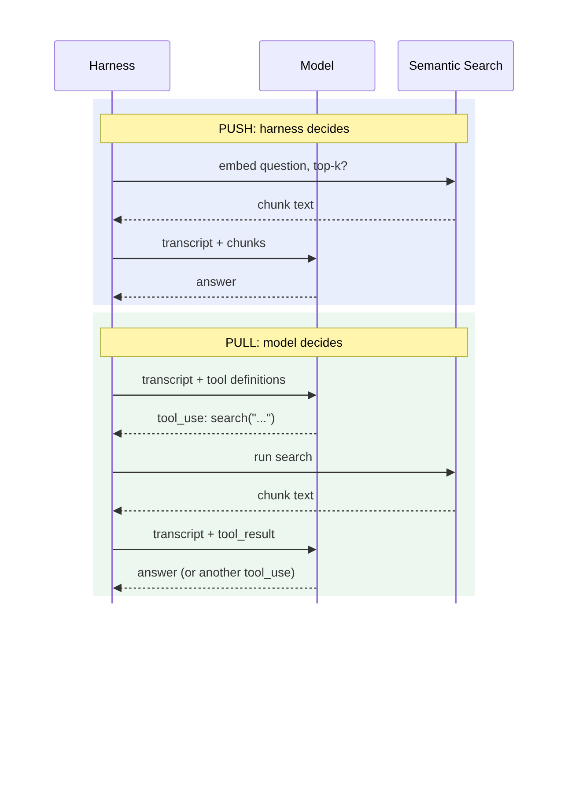
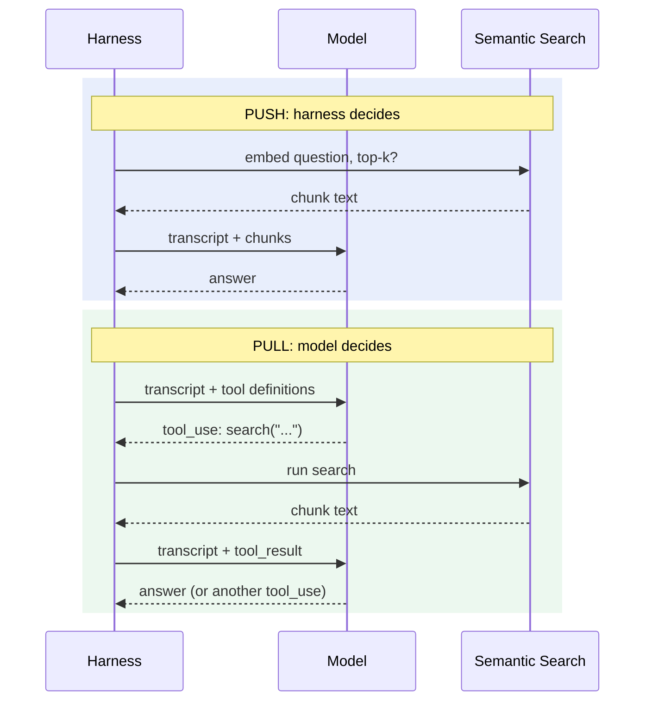

# LLM Memory, Context Management & Extended Reasoning: Deep Dives

Off-curriculum side threads the student asked to keep. These are not part of the core lessons. See the [course map](llm-memory-course-map.md).

---

## Deep dive (after Session 5): push vs. pull, and how tool calls actually work

**Push vs. pull is about who triggers the search, not how the search works.** Any search method fits either pattern:

| | Push (harness triggers it) | Pull (model triggers it) |
|---|---|---|
| **Semantic search** | Classic RAG: embed the question, insert the top-k chunks | Model calls `search_docs("payments timeout")` |
| **Deterministic search** | Harness always greps for the ticket ID it sees in the message | Model calls `grep("Payments API")` |

- Iteration isn't what *makes* it pull. A single search the model chose to run is already pull. Iteration is what pull *makes possible*: the model sees results before answering and can retry.
- Real systems mix both. Push the top 3 chunks, and also give the model a search tool to pull more.

**How it works in practice: the model asks and the harness acts.** The model never executes anything.

1. **The harness advertises tools.** Each request includes tool definitions (name, plain-English description, JSON schema for arguments) at the top of the context. That's why tools come first in the prompt-cache order.
2. **The model "decides" by generating a tool call.** This is still next-token prediction: training taught it to emit a structured block instead of prose. On Claude's API:
   ```json
   { "type": "tool_use", "id": "tu_01", "name": "search_docs",
     "input": { "query": "Payments API timeout" } }
   ```
   Generation then **stops** with stop reason `tool_use`.
3. **The harness executes it**, and may refuse. Claude Code's permission prompts are this step.
4. **The harness appends a `tool_result` block** (linked by `id`) and **resends the whole transcript**. Every tool round trip is a full new call, and prompt caching keeps it affordable.
5. **Repeat** until the model replies with plain text and no tool call. That loop *is* "an agent": a `while` loop around a stateless function, with the harness doing the I/O.

**Consequences:**
- **Tool results are untrusted input.** They enter the context like retrieved chunks, so the Session 5 poisoning risk applies to every tool.
- **Server-side tools** (for example, provider-run web search) follow the same pattern. The provider's infrastructure acts as the harness for that step.

### Data flow: harness, model, and semantic search





The model never talks to the search service directly. Every arrow into or out of the model goes through the harness.

---

## Deep dive (after Session 6): skills vs. subagents, and authoring subagents

**The core distinction:** a **skill shapes what a window *knows*** (a procedure pulled into whichever window needs it). A **subagent decides *which window does the work*** (a fresh, separate workspace that is discarded afterward). The two vary independently and combine freely. For example, a deploy subagent can invoke the deploy-runbook skill inside its own window.

**Who decides which is used?** Mostly the model, by the same mechanism as any pull. Both are tool calls (`Skill(...)` pulls a body into the current window, and `Agent(...)` starts a new one), chosen by matching the pushed *descriptions* against the request. The harness decides only when forced: a user typing `/skill-name`, a hook, or configuration.

**Where detail gets lost:**
- **Skill in the main window:** runbook and logs accumulate in the main context. Detail is lost *later, by accident*, when compaction summarizes.
- **Subagent:** detail is lost *immediately, by design*, when the report is written. The subagent's window is **discarded**, not compacted. Mitigation: have it write full logs to a file and return the path (Session 4 offloading).

**Authoring a subagent** (Claude Code; field names per the docs at time of writing, so verify against the current Subagents page). Place it in `.claude/agents/` (project) or `~/.claude/agents/` (user), or use `/agents`:

```markdown
---
name: deploy-runner
description: Runs production deployments end to end. Use whenever the user
  asks to deploy, release, or ship to production.
tools: Bash, Read, Skill
model: sonnet
---
You execute deployments. Invoke the `deploy-runbook` skill first and follow
it exactly. Write full logs to ./logs/deploy-<timestamp>.log. Return: final
status, any warnings verbatim, and the log path. Nothing else.
```

- The **frontmatter description** is pushed into the main context's index. The **body** becomes the subagent's own system prompt, which the main agent never reads.

**How users steer delegation** (weakest to strongest):
1. **The description:** read every call. Wording like "use proactively" or "use whenever…" encourages automatic delegation.
2. **CLAUDE.md policy:** "Always delegate deployments to deploy-runner." Pushed and reloaded, so it doesn't fade.
3. **Direct request:** "Use deploy-runner to ship this." The most reliable, but only as durable as the chat message.

**What subagents offer that skills don't:**
- **`tools:` gives least privilege.** A read-only reviewer *cannot* edit code, however persuasive a poisoned file is.
- **`model:` gives a cost/speed choice.** Send routine work to a cheaper model.
- **A fresh window gives isolation,** and with it the **most common bug**: the subagent doesn't inherit the conversation. The handoff prompt must be fully self-contained, like a ticket for a contractor who has never met you.
