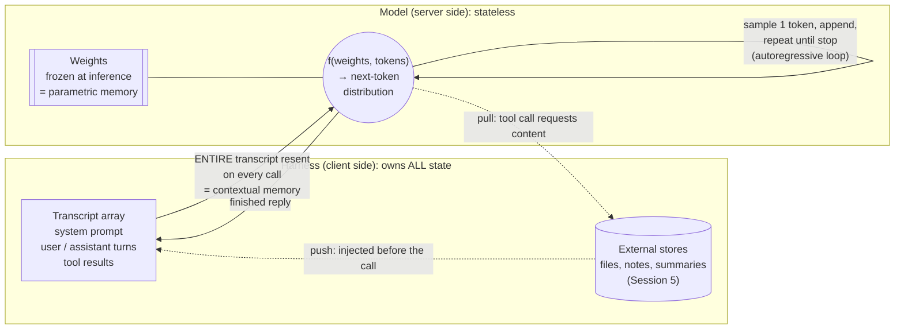
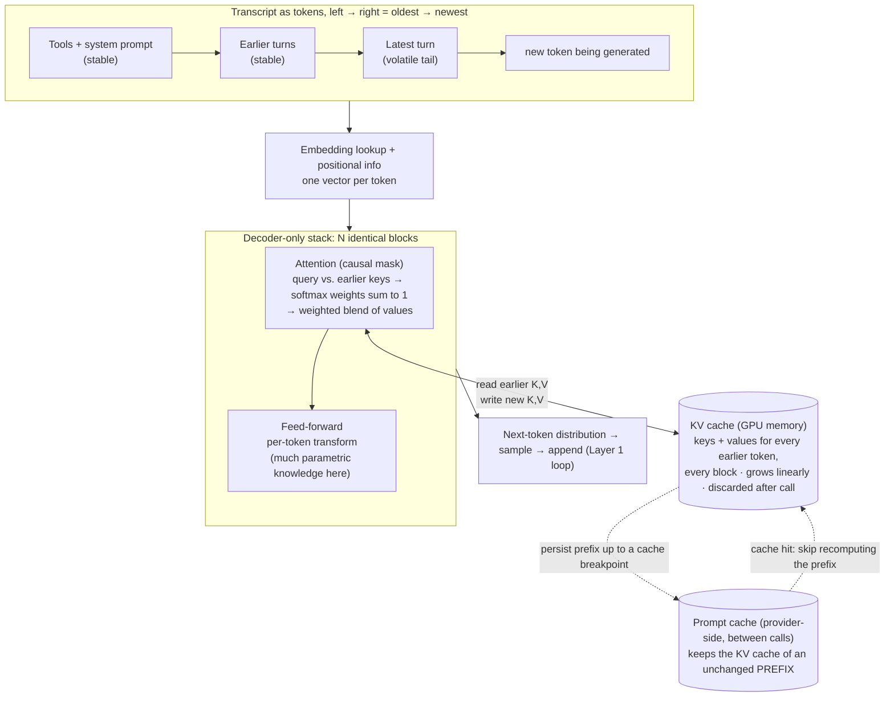
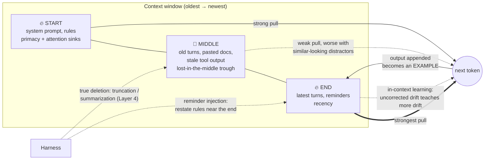
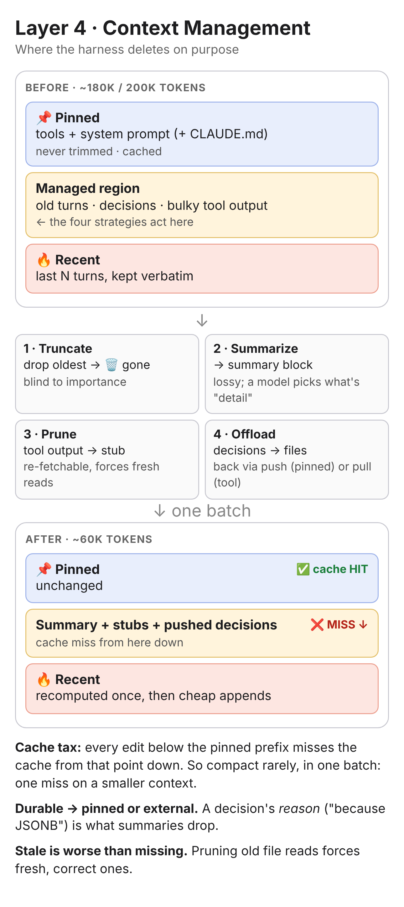
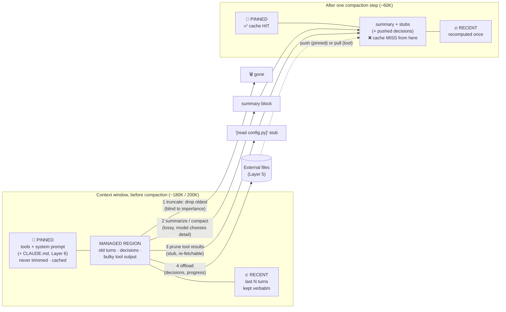
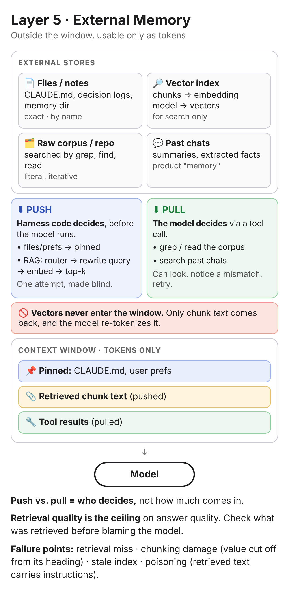
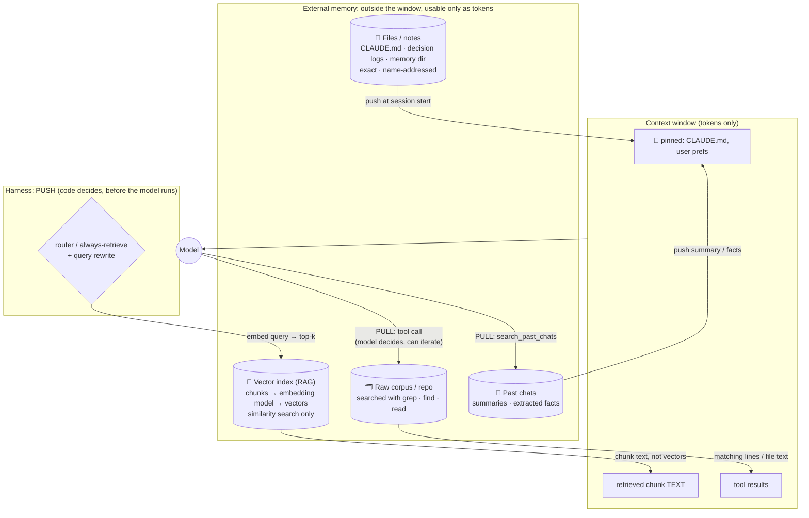

# LLM Memory, Context Management & Extended Reasoning: Claude's Memory Diagram

A diagram of how memory works for an LLM, using Claude (and the Claude Code harness) as the example. It grows by one layer per session. See the [course map](llm-memory-course-map.md).

## Layer 1: The stateless machine (Session 1)

**Reading it:**
- Nothing persists on the model side between calls. Delete the transcript and the model has never met you.
- *Parametric memory* (the weights) changes only when a **new checkpoint** is trained and deployed, over months for pretraining or hours to days for a fine-tune. It never changes during a conversation.
- *Contextual memory* is whatever the harness put in the array **this call**.
- *External memory* reaches the model only by becoming contextual memory, either through **push** (the harness injects it) or **pull** (the model asks for it through a tool).

## Layer 2: Inside the window (Session 2)

What happens to the transcript once it reaches the model, and where the KV cache sits.

**Reading it:**
- **Causal masking** means each token's keys and values depend only on the tokens before it. That's why the KV cache can be reused at all.
- **The prefix property:** edit token *k* and everything from *k* onward must be recomputed. Edit turn 10 of 20 and turns 1–9 (up to the last cache breakpoint before the edit) are reused, while 10–20 are recomputed.
- **Design consequence:** stable content goes first and volatile content last. A timestamp at the top of the system prompt would make every call a full cache miss.

## Layer 3: Where attention goes, and how rules fade (Session 3)

The same transcript, annotated with how strongly the model tends to *use* each region. Nothing is deleted. Some regions just get quieter.

**Reading it:**
- **Attention budget:** every token in the window competes for weights that sum to 1. Similar-looking distractors cost the most.
- **Position:** the start and end are hot and the middle is cold. The *effective* window is smaller than the advertised one.
- **Feedback loop:** each reply is appended and becomes an example for the next. Correct drift early, or edit it out of the history (which costs a cache miss from that point, per Layer 2).
- **Debugging order:** first ask whether the harness deleted it (Layer 4). Then ask whether it was diluted, badly placed, or outvoted by examples.

## Layer 4: Context management, where the harness deletes on purpose (Session 4)

**Reading it:**
- **The cache tax:** any edit below the pinned prefix is a cache miss from that point down. So compaction happens rarely and **in one batch**: one miss on a much smaller context, then cheap appends again.
- **Durable state goes in pinned or external memory.** Conversational state can be allowed to fade. A decision's *reason* ("because JSONB") is exactly what summaries tend to drop.
- **Stale context is worse than missing context.** Pruning old file reads forces fresh re-reads that match the current file.

## Layer 5: External memory and retrieval paths (Session 5)

**Reading it:**
- **Push vs. pull is about *who decides*, not how much.** Classic RAG is push (harness code decides). Agentic search is pull (the model decides, and can retry after seeing a wrong result).
- **Vectors never enter the window.** Retrieval embeddings exist only for search. The model receives the chunk's text and re-tokenizes it.
- **Failure points:** retrieval miss (wrong chunk), chunking damage (fact separated from its heading), staleness (old index), and poisoning (retrieved text carries instructions).
