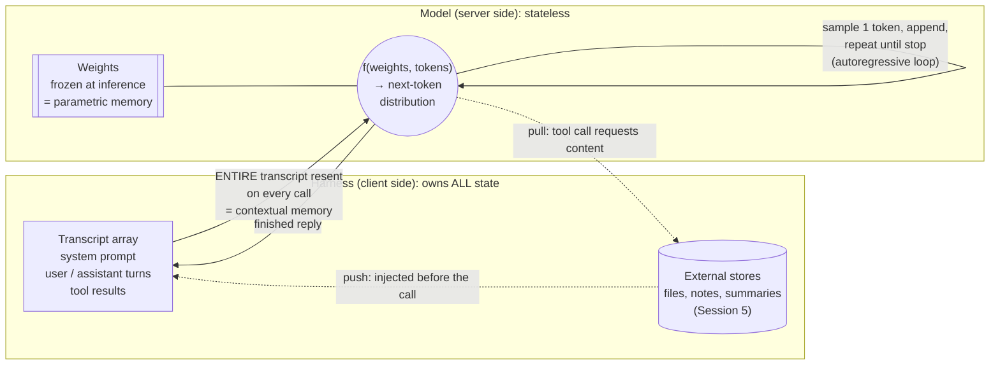
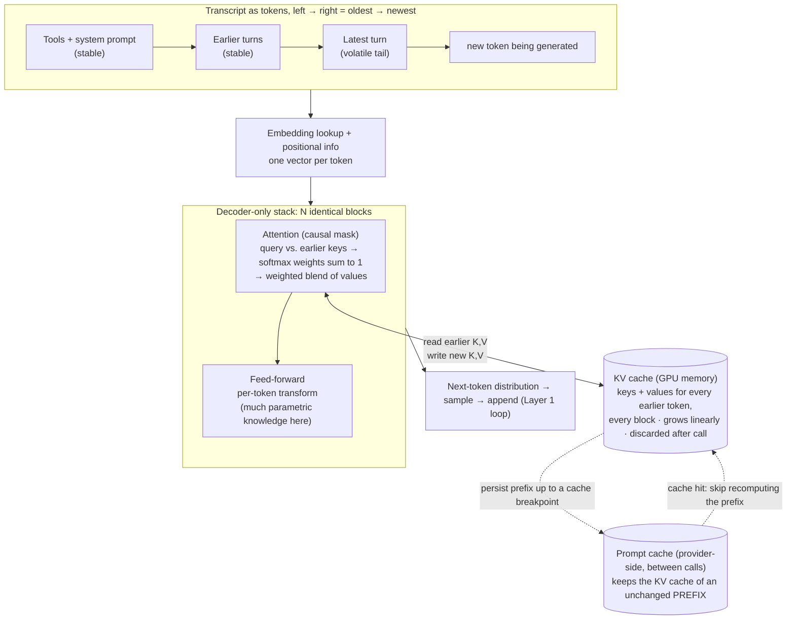

# LLM Memory, Context Management & Extended Reasoning: Claude's Memory Diagram

A diagram of how memory works for an LLM, using Claude (and the Claude Code harness) as the example. It grows by one layer per session. See the [course map](llm-memory-course-map.md).

## Layer 1: The stateless machine (Session 1)

**Reading it:**
- Nothing persists on the model side between calls. Delete the transcript and the model has never met you.
- *Parametric memory* (the weights) changes only when a **new checkpoint** is trained and deployed, over months for pretraining or hours to days for a fine-tune. It never changes during a conversation.
- *Contextual memory* is whatever the harness put in the array **this call**.
- *External memory* reaches the model only by becoming contextual memory, either through **push** (the harness injects it) or **pull** (the model asks for it through a tool).

## Layer 2: Inside the window (Session 2)

What happens to the transcript once it reaches the model, and where the KV cache sits.

**Reading it:**
- **Causal masking** means each token's keys and values depend only on the tokens before it. That's why the KV cache can be reused at all.
- **The prefix property:** edit token *k* and everything from *k* onward must be recomputed. Edit turn 10 of 20 and turns 1–9 (up to the last cache breakpoint before the edit) are reused, while 10–20 are recomputed.
- **Design consequence:** stable content goes first and volatile content last. A timestamp at the top of the system prompt would make every call a full cache miss.
