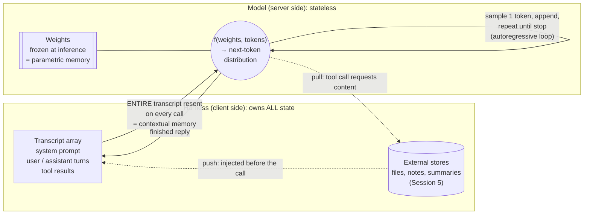

# LLM Memory, Context Management & Extended Reasoning: Claude's Memory Diagram

A diagram of how memory works for an LLM, using Claude (and the Claude Code harness) as the example. It grows by one layer per session. See the [course map](llm-memory-course-map.md).

## Layer 1: The stateless machine (Session 1)

**Reading it:**
- Nothing persists on the model side between calls. Delete the transcript and the model has never met you.
- *Parametric memory* (the weights) changes only when a **new checkpoint** is trained and deployed, over months for pretraining or hours to days for a fine-tune. It never changes during a conversation.
- *Contextual memory* is whatever the harness put in the array **this call**.
- *External memory* reaches the model only by becoming contextual memory, either through **push** (the harness injects it) or **pull** (the model asks for it through a tool).
